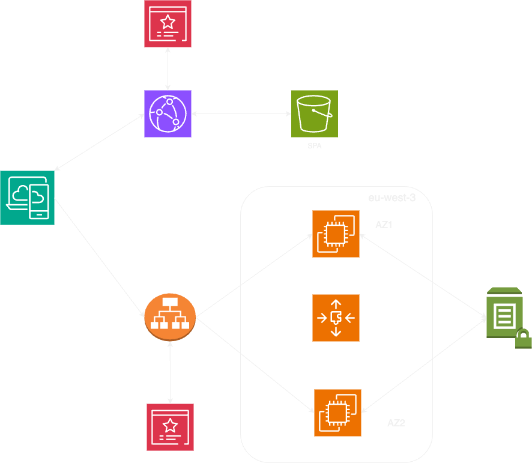

# Analyst-toolkit-architecture
The Analyst-toolkit application aims at easing the work of business analysts. 

It helps delivering high quality specifications by removing typos, enhancing the vocabulary, and translating the content.

[WORK IN PROGRESS]: the translation and typos removal features are available as of now. To test the application, email me at soufianerahj23@gmail.com. 

For infrastructure cost reasons I don't keep the application UP 24/7.

## Architecture of the Infrastructure of the Analyst-toolkit application

To explain the previous infrastructure let's consider separately the Front End and Back End Applications.

### Infrastructure of the Front End
The Front End application is a React app. S3 hosts the build of the source Code. 

A cloudfront Distribution is created with the S3 bucket as an origin (not S3 for static website hosting). The default behavior is the S3 Bucket. There will be 2 behaviors linked to 2 buckets afterwards to allow blue/green deployments.

ACM is used to generate TLS certificates on US-EAST-1 for the cloudfront distribution.

An alias record is created on route53 to point to the cloudfront distribution.

### Infrastructure of the Back End

The Application Load Balancer is associated with 2 AZs. 

A target group is created containing an autoscaling group of EC2 instances that spans across 2 AZs.

A TLS certificate is generated using ACM on eu-west-3. 

An https listener is configured on the ALB and sends trafic to the created target group with the ASG. the listener is configured with the generated TLS certificate.

An alias record is created on route53 and points to the ALB.

The Back End is a Node.js application. PM2 is used as a process manager to take advantage of multiple cores in the EC2 instances. 

Sensitive data (api keys) are stored on SSM parameter store as secrets and requested from the instances in order to be passed to PM2 as environment variables. This allow child processes to be able to fetch the required secrets.

### Security

SSM Parameter store is used to store secrets. 

A TLS certificate is associated to the ALB to allow https protocol.

A security group is created for the ALB allowing https traffic from anywhere.

A security group is created for EC2 instances allowing traffic from the Security group of the ALB.

No SSH port open on the EC2 instances. All access is done through AWS Session Manager.

### Continuous delivery of the Front End

### Continuous delivery of the Back End

An S3 bucket is created to contain the artifcat that will be deployed on the EC2 instances. The S3 bucket must be in the same region as the EC2 instances (eu-west-3 in this case).

AWS CodeDeploy is used to deploy this artifact into the EC2 instances. 

The following IAM permissions are required in order to allow Code Deploy to interact with the EC2 instances.
- Create a role for codeDeploy with the managed policy AWSCodeDeployRole
- The EC2 instances role must allow access the S3 bucket containing the revision code. 

Install the codedeploy agent on the EC2 instances. This is be done with AWS SSM Distributor that helps installing the relevant package on SSM managed EC2 instances.

The EC2 instances are tagged as well with the APP name and the ENV name to distinguish the EC2 instances at the deployment time.

Create app on code deploy, and create a deployment group

The root of the application revision must contain : 
- appspec.yml
- scripts (stop_application.sh, before_install.sh, after_install.sh, start_server.sh)
The revision code + above files are zipped and stored on the S3 bucket.

All scripts must have appropriate execution permission. Ie, it is a bad practice to run the app entry point with root privileges for security reasons.
