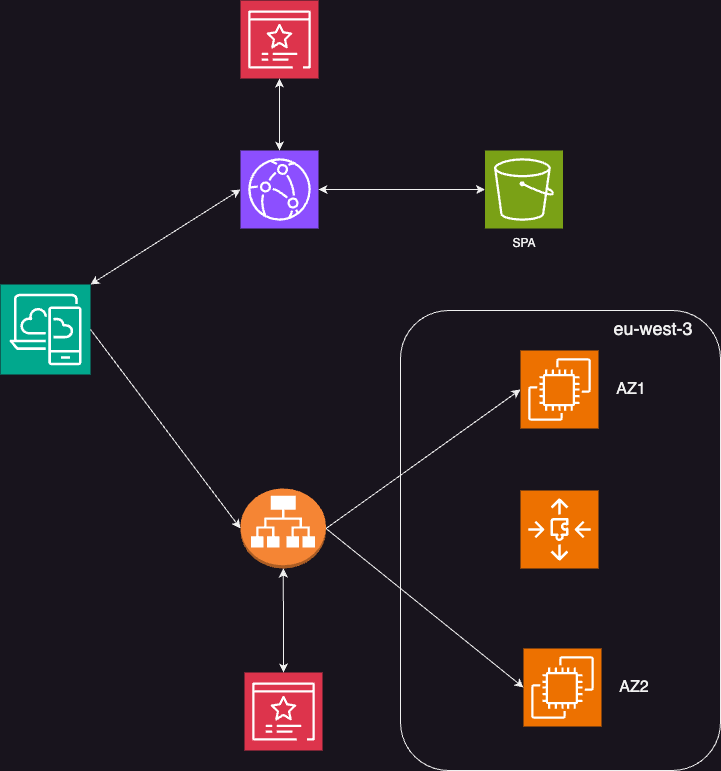

# Analyst-toolkit-architecture
The Analyst-toolkit application aims at easing the work of business analysts. 

It helps delivering high quality specifications by removing typos, enhancing the vocabulary, and translating the content.

[WORK IN PROGRESS]: the translation and typos removal features are available as of now. To test the application, email me at soufianerahj23@gmail.com. 

For infrastructure cost reasons I don't keep the application UP 24/24.

## Architecture of the Infrastructure of the Analyst-toolkit application

To explain the previous infrastructure let's consider separately the Front End and Back End Applications.

### Infrastructure of the Front End

### Infrastructure of the Back End

### Continuous delivery of the Front End

### Continuous delivery of the Back End

### IAC 

### Monitoring and Logging
